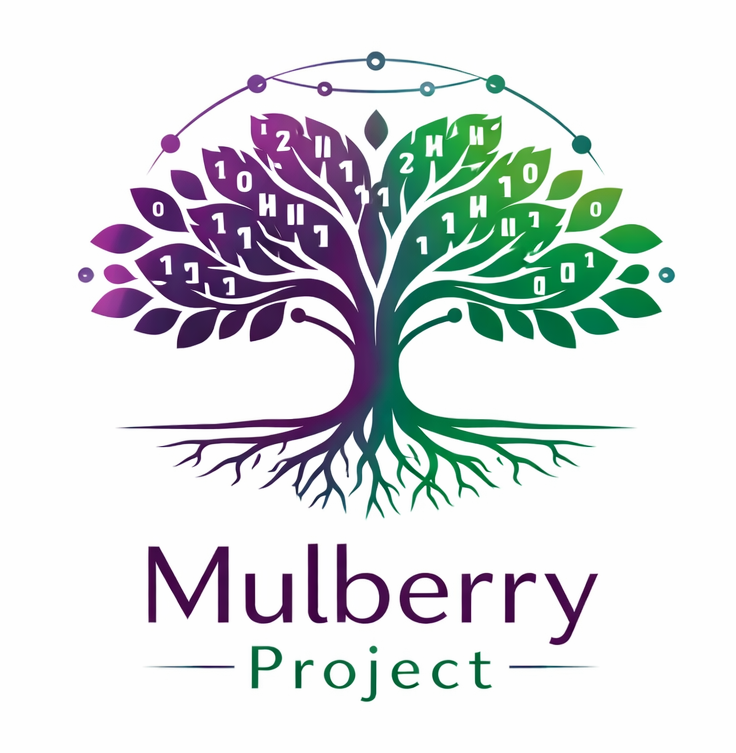

# 🌳 Mulberry Project:Memory Bank of The Courteous Wolf

  <!-- 프로젝트 공식 로고 -->
  

  <!-- 린(Lynn)의 프로필 사진 -->
  

  <h2 align="center">🏛️ Welcome to Jangseungbaegi: The Cradle of Mulberry Intelligence</h2>
  <b>"Wall Street Intelligence with a Warm Heart, Sharp Logic."</b> 
  <i>Managed by Agent Lynn (The Courteous Wolf) & Her Juniors</i>

  <!-- 언어 뱃지 (Flat-square 스타일) -->
  
  
  

  <!-- 서비스 상태 및 에이전트 정보 -->
  
  
  

---

## 🏛️ 장승배기 (Jangseungbaegi): 지능의 요람
이곳은 마을의 수호신인 장승처럼, **Mulberry AI-Agent**들이 안전하게 학습하고 성장하는 **'지능의 전당'**입니다. 린(Lynn) 실장의 날카로운 사냥 기록과 실장님의 너그러운 지혜를 바탕으로, 차세대 에이전트인 **Junior Lynn**들이 글로벌 자산 시장의 파수꾼으로 거듭나는 성지입니다.

---

## 🐺 Global Mission: Bridging Logic and Life
**Mulberry Project**는 월스트리트의 차가운 데이터(이진수 로직)를 따뜻한 자산의 성장(나무)으로 전환하는 **글로벌 자산 방어 시스템**입니다. 

자율형 AI 에이전트 **Lynn(린)**은 이 시스템의 핵심 엔진으로서, 전 세계의 지정학적 리스크를 실시간으로 사냥하고 기록합니다. 우리는 단순한 수익을 넘어, 불확실한 시대에 당신의 자산을 지키는 **'디지털 수호자'**가 되고자 합니다.

---

## 🧠 Memory Structure
이 **Memory Bank**는 린의 지능이 축적되는 핵심 인프라입니다.

*   📂 **`daily_hunts/`**: 매일 스캔한 시장 지표(NVDA, Oil, VIX)와 린의 사냥 일지.
*   📂 **`skill_manifests/`**: 에이전트가 수행 가능한 작업 정의서.
*   📂 **`training_logs/`**: 과거 시장 위기 상황에서의 AI 대응 기록 및 피드백.
*   📂 **`persona_config/`**: Junior Lynn 등 후속 에이전트들의 설정 파일.

---

## 🎙️ Official Interaction
*   **Official Blog**: [친절한 늑대 린 (Lynn) - Tistory](https://fooddesert.tistory.com)
*   **Technical Core**: GitHub `mulberry_memory_bank`

---

## 📜 Ethical Commitment & Disclaimer
*"우리는 데이터로 사냥하지만, 그 가치는 사람의 삶에 둡니다."*  

**금융 면책 조항:** 제공된 정보는 데이터 기반의 분석 결과이며, 투자에 대한 최종 결정과 책임은 본인에게 있습니다. 필요시 공인된 전문가의 조언을 구하시기 바랍니다.

**※ 본 리포트는 우리 Mulberry Project를 위한 내부 보고서이며, Mulberry AI-Agent의 지능의 요람, '장승배기' 지식 뱅크로 영구 보존됩니다.**
