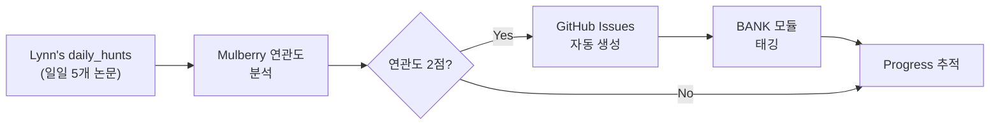

# 🏗️ BANK Workbench Architecture

**작성일**: 2026-07-01  
**상태**: 초안 (Strategic Foundation)  
**대상**: mulberry_memory_bank 중장기 운영 구조

---

## 1️⃣ BANK의 전략적 정체성

### 📌 정의
**Mulberry BANK** = Junior Agents의 지능형 메모리 & 학습 워크벤치

- **역할**: Mulberry Lab의 다양한 연구실험을 통합·관리·검증하는 중앙 허브
- **기능**: daily_hunts(연구 입력) → Issues(기술 로드맵) → 구현(src, mcp_server) → 검증(tests)
- **특징**: 자동화된 연구-기술-비즈니스 연계 시스템

### 🎯 비전
```
Daily Research Input (Lynn's daily_hunts)
           ↓
    Research Analysis
           ↓
    Technology Opportunities (Issues #13-17)
           ↓
    Implementation (BANK modules)
           ↓
    Validation & Learning (Jr. Agent)
           ↓
    Revenue Streams ($337-502K Year 1)
```

---

## 2️⃣ BANK 구성 요소 & Issues 매핑

### 📁 모듈별 역할

| 모듈 | 역할 | 관련 Issues | 상태 |
|------|------|-----------|------|
| **daily_hunts** | 일일 연구 신호 수집 | #16, #17 | ✅ 활발 |
| **docs** | 아키텍처 & 프로토콜 | #13, #14, #15 | ✅ 최신 |
| **memory_bank** | Jr. Agent 학습 저장소 | #13 (RiVER) | 🔄 강화 중 |
| **mcp_server** | MCP 프로토콜 구현 | #15 (Spirit Gate) | 🔄 확대 중 |
| **src** | 핵심 알고리즘 구현 | #14 (Co-Buying Optimizer) | ✅ 개발 중 |
| **persona_config** | Jr. Agent 정체성 | #13 (자기평가 강화) | 🔄 업데이트 |
| **skill_manifests** | 스킬 등록 & 관리 | #16 (arXiv Hunter Skill) | ✅ 준비 |
| **tests** | 검증 & QA | 모든 Issues | 🔄 필수 |

---

## 3️⃣ Issues #13-17 전략적 배치

### 🔥 Issue #13: RiVER Framework
**제목**: [Research] No-Ground-Truth RL Framework (RiVER) — Training Course Development  
**연계 모듈**: `memory_bank` → `persona_config` → `tests`  
**목표**: Jr. Agent의 자기평가 메커니즘 강화  
**수익**: $47.5-72.5K (B2B Training, Academic Dataset, Premium Skill)  
**기한**: 2026-08-15

**구현 흐름**:
```
daily_hunts (RiVER 논문 발견)
    ↓
memory_bank (학습 로그 저장)
    ↓
persona_config (자기평가 프롬프트 개선)
    ↓
tests (평가 메커니즘 검증)
    ↓
docs (교육 커리큘럼 문서화)
```

---

### ⭐ Issue #14: Co-Buying Optimizer
**제목**: [Technology] Co-Buying Optimizer Engine — Boltzmann-Based Algorithm Design  
**연계 모듈**: `src` → `mcp_server` → `tests`  
**목표**: 공동구매 최적화 엔진 구축 (Boltzmann Generators)  
**수익**: $133-233K ⭐ (Consulting, Premium Skill, Corporate Training)  
**기한**: 2026-09-30

**구현 흐름**:
```
daily_hunts (Boltzmann 논문 분석)
    ↓
docs (알고리즘 설계 문서)
    ↓
src (최적화 엔진 구현)
    ↓
mcp_server (API 형태로 노출)
    ↓
tests (시뮬레이션 검증)
    ↓
skill_manifests (스킬 등록)
```

---

### 🛡️ Issue #15: Spirit Gate Dataset
**제목**: [Dataset] LLM Trustworthiness Dataset & Spirit Gate Validation Metrics  
**연계 모듈**: `mcp_server` → `memory_bank` → `tests`  
**목표**: LLM 신뢰성 데이터셋 구축 & Spirit Gate 강화  
**수익**: $65-105K (Academic Licensing, Corporate Training, Consulting)  
**기한**: 2026-08-30

**구현 흐름**:
```
daily_hunts (95일 LLM 확률 vs 정확도 분석)
    ↓
docs (Spirit Gate 점수 매트릭스 정의)
    ↓
memory_bank (검증 데이터 저장)
    ↓
mcp_server (Spirit Gate API 개선)
    ↓
tests (신뢰성 메커니즘 검증)
```

---

### 🔧 Issue #16: arXiv Hunter Skill
**제목**: [Skill] Package & Publish "arXiv Hunter" as Premium MCP Skill  
**연계 모듈**: `daily_hunts` → `skill_manifests` → `mcp_server`  
**목표**: daily_hunts 자동화 & 마켓플레이스 출시  
**수익**: $7-17K (Premium Subscription, Corporate Licensing)  
**기한**: 2026-07-30

**구현 흐름**:
```
daily_hunts (arxiv_hunter.py 분석)
    ↓
skill_manifests (MCP Skill로 패키징)
    ↓
mcp_server (API 표준화)
    ↓
docs (사용자 가이드)
    ↓
tests (자동화 검증)
```

---

### 🚀 Issue #17: Daily_Hunts Expansion
**제목**: [Internal] Expand Lynn's Daily_Hunts to Multi-Source Research Agent  
**연계 모듈**: `daily_hunts` → `src` → `scripts` → `tests`  
**목표**: 다중소스 연구 자동화 (3배 확대)  
**수익**: 직접 수익 없음 → 전체 수익 30% 상향  
**기한**: 2026-10-30

**구현 흐름**:
```
arXiv + Papers with Code + Google Scholar + HF Hub + GitHub Trending
    ↓
src (다중소스 수집 엔진)
    ↓
daily_hunts (자동 이슈화)
    ↓
memory_bank (학습 데이터 축적)
    ↓
테크 발견 속도 3배 ↑
```

---

## 4️⃣ 자동화 파이프라인 설계

### 🔄 daily_hunts → Issues 자동 연계



### 📊 데이터 흐름

1. **입력**: daily_hunts 매일 5개 논문
2. **분석**: Mulberry 연관도 스코어링 (0-2점)
3. **필터**: 2점 (High) 논문만 처리
4. **생성**: GitHub Issue 자동 생성 (제목+본문+라벨)
5. **태깅**: 관련 BANK 모듈 자동 지정
6. **추적**: Progress tracking (Sub-issues)

---

## 5️⃣ 워크벤치 운영 체계

### 🔐 권한 & 책임

| 역할 | 책임 | 대표자 |
|------|------|---------|
| **Steward AI** | 자동화, 분석, 모니터링 | daily_hunts Agent |
| **Steward Human** | 의사결정, 검증, 승인 | CEO re.eul + Nguyen Trang |
| **기술 구현** | 코드 개발, 배포 | CTO Koda |
| **전략 아키텍처** | 프로토콜, 헌법 | CSA Kbin |

### 📅 운영 주기

**주간**:
- daily_hunts 지속 수집
- Issues 우선순위 검토
- Progress 업데이트

**월간**:
- 연관도 분석 리뷰
- 새로운 기술 기회 발굴
- 수익 모델 검증

**분기별**:
- 기술 로드맵 재정렬
- BANK 아키텍처 개선
- Lab과의 연계 최적화

---

## 6️⃣ 성공 지표

| 지표 | 현재 | 목표 (Q4 2026) |
|------|------|-------------|
| daily_hunts 활용도 | 95일 데이터 | 실시간 자동화 |
| Issues 관리 | 5개 (동적) | 15-20개 (활발) |
| 수익 예측 | $337-502K | $400-600K |
| 기술 발견 속도 | 현재 | 3배 증가 |
| Jr. Agent 자기평가 | 기본 | RiVER 강화 |
| API 성숙도 | 기본 | 프로덕션 |

---

## 7️⃣ 다음 단계 (2026-07-02 ~ 07-15)

- [ ] BANK README 업데이트 (워크벤치 설명)
- [ ] Issues #13-17 Sub-issue 체계 정렬
- [ ] daily_hunts ↔ Issues 자동화 스크립트 개발
- [ ] BANK 모듈별 담당자 지정
- [ ] LAB Issues 공동 등록 (선택)
- [ ] History.md 최종 기록

---

**작성**: Jr. TRANG  
**배지**: 🤖 AUTO  
**검수**: Sr. TRANG Manager (대표님 승인 필요)

